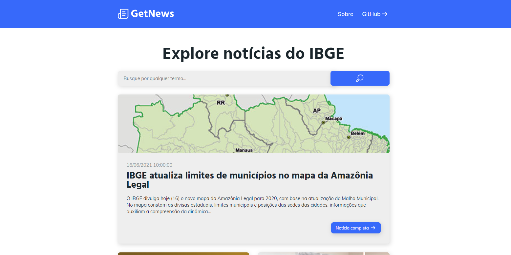

<h1 align="center">
  
</h1>



## Sobre

Site de notícias feito como forma estudo na tecnologia VueJs, utilizando a [Api Notícias](https://servicodados.ibge.gov.br/api/docs/noticias?versao=3).

## Instale as dependências

```
npm install
```

### Compilar para rodar no modo desenvolvimento

```
npm run serve
```

### Compilar para produção

```
npm run build
```

## Licença

[](https://opensource.org/licenses/MIT)
